<div align="center">
  
</div>

# 🚗 Sviluppo Back-End per un Sistema di Controllo Accessi e Gestione Parcheggi

[](https://www.postgresql.org/)
[](https://nodejs.org/en)
[](https://sequelize.org/)
[](https://expressjs.com/it/)
[](https://jwt.io/)
[](https://www.typescriptlang.org/)
[](https://www.postman.com/)

## 📌 Descrizione del progetto

Il progetto nasce come elaborato per il superamento del corso di Programmazione Avanzata (A.A. 2024/2025), e ha come obiettivo la realizzazione di un sistema back-end per la gestione di parcheggi, con particolare attenzione al controllo degli accessi, alla registrazione dei transiti dei veicoli e al calcolo automatico delle tariffe.

Nel contesto proposto, ogni parcheggio può essere dotato di più varchi di ingresso e uscita, e può accogliere veicoli di diverse tipologie, ognuna associata a un costo orario specifico. Il sistema consente di gestire in modo digitale il flusso dei veicoli: l'ingresso e l'uscita vengono registrati tramite i varchi, tenendo conto della disponibilità dei posti e della tipologia del varco, che può essere di tipo standard (con riconoscimento della targa tramite immagine OCR) o smart (con invio diretto della targa in formato JSON).

L'utente automobilista può consultare lo storico dei propri transiti, scaricare le fatture, verificare lo stato dei pagamenti e procedere al saldo delle spese tramite l'apposita interfaccia. Gli operatori hanno accesso a funzionalità avanzate, come la gestione dei parcheggi, delle tariffe, dei varchi e delle statistiche dettagliate sull'occupazione, il numero di transiti e il fatturato generato.

Il sistema è stato pensato per essere scalabile, sicuro e flessibile, integrando funzionalità di autenticazione tramite token JWT, validazione delle richieste, generazione di PDF (fatture, bollettini di pagamento con QR code, ricevute) e controllo dei permessi in base al ruolo dell'utente.

---

## 🛠️ Tecnologie utilizzate

- **Node.js** & **Express.js** – per la creazione del server RESTful.
- **TypeScript** – per tipizzazione forte e maggiore robustezza.
- **PostgreSQL** – come database relazionale.
- **Sequelize** – ORM per la gestione del database.
- **JWT (JSON Web Tokens)** – per autenticazione e gestione sessioni.
- **Jest** – per l’esecuzione di test automatici.
- **Docker** & **Docker Compose** – per ambienti di sviluppo e distribuzione coerenti.
- **Postman** – per test manuali delle API.
- **PDFKit / QR-code** – per la generazione di documenti PDF e codici QR.

---

## 📄 Specifiche e requisiti funzionali

Il sistema deve garantire le seguenti funzionalità:

- **Gestione parcheggi e varchi**  
  - Creazione, lettura, aggiornamento e cancellazione (CRUD) di parcheggi e varchi associati.  
  - I varchi possono essere di tipo standard (upload immagine targa) o smart (invio JSON con targa).  
  - I varchi possono essere bi-direzionali.

- **Gestione tariffe**  
  - CRUD delle tariffe di parcheggio, con differenziazione per tipo di veicolo, fascia oraria e giorno (festivo/feriale).

- **Gestione transiti**  
  - Inserimento transiti (ingresso e uscita) con data/ora, targa e varco specifico.  
  - Rifiuto inserimento se il parcheggio non ha posti disponibili.  
  - Calcolo automatico del costo del parcheggio in base alla permanenza e alle tariffe.  
  - Generazione automatica della fattura associata all’utente all’atto dell’uscita.

- **Consultazione transiti e fatture**  
  - Visualizzazione stato transiti per una o più targhe in un intervallo temporale, con output in JSON o PDF.  
  - Accesso limitato: gli utenti vedono solo i propri veicoli, gli operatori vedono tutti.

- **Statistiche e report**  
  - Rotte per ottenere statistiche aggregate su fatturato, posti liberi medi, transiti distinti per fascia oraria e tipologia veicolo, filtrabili per periodo.  
  - Output disponibile in JSON o PDF.

- **Gestione pagamenti**  
  - Verifica stato pagamento fatture per utente, con filtri per stato pagamento, data ingresso e uscita.  
  - Generazione PDF di bollettini di pagamento con QR code identificativo.  
  - Possibilità per l’utente di pagare il bollettino.  
  - Gli operatori possono ricaricare il credito degli utenti.  
  - Scaricamento ricevute di pagamento in PDF.

- **Sicurezza e autenticazione**  
  - Tutte le rotte sono protette con autenticazione JWT.  
  - Gestione ruoli e permessi (utente, operatore).  
  - Validazione delle richieste e gestione centralizzata degli errori tramite middleware.

- **Altri requisiti**  
  - Implementazione in TypeScript.  
  - Persistenza dati tramite database relazionale interfacciato con Sequelize (DB a scelta del gruppo).  
  - Avvio del progetto tramite `docker-compose`.  
  - Almeno 4 test automatici con Jest.

---

## 📁 Struttura del progetto

```text
Backend-per-la-gestione-di-parcheggi-multi-accesso-con-OCR-fatturazione-automatica-e-statistiche/
│
├── postman/
│   └── ProgettoPA API.postman_collection.json
│
├── src/
│   ├── __tests__/                  # Test automatici con Jest
│   ├── assets/                    # Diagrammi UML (sequenze, casi d’uso, E-R)
│   ├── controllers/               # Controller REST per ogni dominio
│   ├── dao/                       # Data Access Object
│   ├── helpers/                   # Funzioni di utilità (PDF, errori, ecc.)
│   ├── middlewares/              # Middleware di autenticazione, validazione, ruoli
│   ├── models/                    # Modelli Sequelize (definizione schema DB)
│   ├── routes/                    # Definizione delle API REST
│   └── app.ts                     # Entry point principale dell’applicazione
│
├── .dockerignore
├── .gitignore
├── docker-compose.yml
├── Dockerfile
├── jest.config.cjs
├── eslint.config.cjs
├── package.json
├── package-lock.json
├── README.md
```


## 🧱 Pattern Architetturali Utilizzati

Il progetto adotta un'architettura modulare ispirata al pattern **Model-View-Controller (MVC)**, opportunamente adattata al contesto di un'applicazione **interamente back-end** e **RESTful**.

### 🔄 Adattamento del pattern MVC

Nel nostro caso, la classica struttura `Model → View → Controller` è stata adattata come segue:

- **Model**  
  Contiene la definizione delle entità del dominio, realizzate tramite Sequelize. I modelli rappresentano lo schema delle tabelle del database e includono relazioni, vincoli e metadati.

- **Controller**  
  Gestisce le richieste HTTP e funge da intermediario tra il client e la logica applicativa. I controller raccolgono i dati dalle richieste, invocano i servizi appropriati e restituiscono le risposte nel formato atteso (JSON o file PDF).

- **Service (al posto della View)**  
  In assenza di un'interfaccia grafica, il layer **Service** sostituisce il ruolo tradizionale della "View". I servizi contengono la **logica applicativa pura**, come il calcolo degli importi, la gestione dei pagamenti, la logica dei transiti, ecc.  
  Questo layer favorisce la riusabilità e mantiene i controller snelli e focalizzati solo sulla gestione delle richieste.

> 📝 Questo approccio mantiene i vantaggi del pattern MVC (separazione delle responsabilità), adattandoli a un'architettura back-end moderna basata su API REST.

---

### 🗃️ DAO (Data Access Object)

Per isolare l'accesso al database, il progetto utilizza il pattern **DAO (Data Access Object)**. Ogni entità ha un modulo DAO dedicato all’interno della cartella `dao/`, responsabile delle operazioni CRUD e delle query complesse.

- Questo layer consente di:
  - Separare la logica applicativa dalla persistenza
  - Facilitare la scrittura di test automatici
  - Centralizzare e riutilizzare l’accesso ai dati

Esempi:
- `transitDao.ts` → operazioni su transiti, ingresso/uscita, calcoli permanenza
- `invoiceDao.ts` → gestione fatture, filtri per utente e stato pagamento
- `parkingDao.ts` → query su disponibilità posti, gestione parcheggi e varchi

---

### ✅ Vantaggi dell’approccio adottato

- **Separazione chiara** tra accesso ai dati, logica applicativa e gestione HTTP
- Alta **manutenibilità** e **scalabilità** del progetto
- Facilità nell’**integrazione di test** e nel debugging
- **Estendibilità**: nuovi domini si implementano creando Model + DAO + Service + Controller

Questa struttura architetturale ha guidato lo sviluppo di un'applicazione robusta, coerente e facilmente estendibile, in linea con le best practice per sistemi RESTful di media-alta complessità.

## 📡 API Endpoint – Panoramica

| Metodo | Endpoint                          | Descrizione                                              | Accesso         |
|--------|-----------------------------------|----------------------------------------------------------|-----------------|
| `POST` | `/api/login`                      | Autenticazione e ottenimento token JWT                   | Utente e Operatore |
| `GET`  | `/api/users`                      | Restituisce gli utenti (solo per operatore)              | Operatore       |
| `GET`  | `/api/users/:id`                  | Dati di un singolo utente  (solo propri per utenti)      | Utente e Operatore |
| `POST` | `/api/users`                      | Crea un nuovo utente                                     | Operatore       |
| `PUT`  | `/api/users/:id/recharge`         | Ricarica credito utente                                  | Operatore          |
| `DELETE` | `/api/users/:id`               | Elimina un utente                                        | Operatore       |
| `GET`  | `/api/transits`                   | Elenco transiti (solo propri per utenti)                 | Utente e Operatore |
| `POST` | `/api/transits`                   | Registra un nuovo transito                               | Operatore       |
| `PUT`  | `/api/transits/:id`               | Aggiorna un transito                                     | Operatore       |
| `DELETE`| `/api/transits/:id`              | Elimina un transito                                      | Operatore       |
| `GET`  | `/api/invoices`                   | Visualizza le fatture     (solo propre per utente)       | Utente e Operatore |
| `POST` | `/api/invoices/:id/pay`           | Effettua il pagamento di una fattura                     | Utente          |
| `GET`  | `/api/stats/revenue`              | Statistiche di fatturato tra due date                    | Operatore       |
| `GET`  | `/api/parkings`                   | Elenco parcheggi                                         | Operatore       |
| `POST` | `/api/parkings`                   | Crea un nuovo parcheggio                                 | Operatore       |
| `PUT`  | `/api/parkings/:id`               | Modifica un parcheggio                                   | Operatore       |
| `DELETE`| `/api/parkings/:id`              | Elimina un parcheggio                                    | Operatore       |
| `GET`  | `/api/gates`                      | Elenco varchi                                            | Operatore       |
| `POST` | `/api/gates`                      | Crea un nuovo varco                                      | Operatore       |
| `PUT`  | `/api/gates/:id`                  | Modifica un varco                                        | Operatore       |
| `DELETE`| `/api/gates/:id`                 | Elimina un varco                                         | Operatore       |
| `GET`  | `/api/tariffs`                    | Elenco tariffe                                           | Operatore       |
| `POST` | `/api/tariffs`                    | Crea una nuova tariffa                                   | Operatore       |
| `PUT`  | `/api/tariffs/:id`                | Modifica una tariffa                                     | Operatore       |
| `DELETE`| `/api/tariffs/:id`               | Elimina una tariffa                                      | Operatore       |
| `GET`  | `/api/vehicle-types`              | Tipologie di veicolo disponibili                         | Operatore       |
| `PUT`  | `/api/vehicle-types/:id`          | Modifica una tipologia di veicolo                        | Operatore       |
| `DELETE`| `/api/vehicle-types/:id`         | Elimina una tipologia di veicolo                         | Operatore       |
| `GET`  | `/api/user-vehicles`              | Elenco veicoli associati (solo i proprio per l'utente)   | Utente e Operatore |
| `POST` | `/api/user-vehicles`              | Associa un veicolo a un utente                           | Operatore          |
| `DELETE`| `/api/user-vehicles/:id`         | Rimuove un veicolo dell’utente                           | Operatore       |

---

### 🛡️ Legenda accesso

- **Utente**: autenticato con ruolo `"utente"`
- **Operatore**: autenticato con ruolo `"operatore"`
- **Entrambi**: endpoint accessibile a entrambi i ruoli con comportamenti differenziati


## 📚 Diagrammi UML 

## 🗃️ Schema ER (Entità-Relazioni)
   
   

### ✅ Diagrammi dei Casi d'Uso

-
  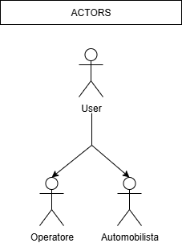

- 
  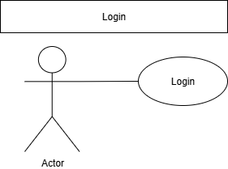

- 
  

- 
  

---

### 📈 Diagrammi delle Sequenze principali

| Endpoint | Immagine |
|---------|----------|
| Login | 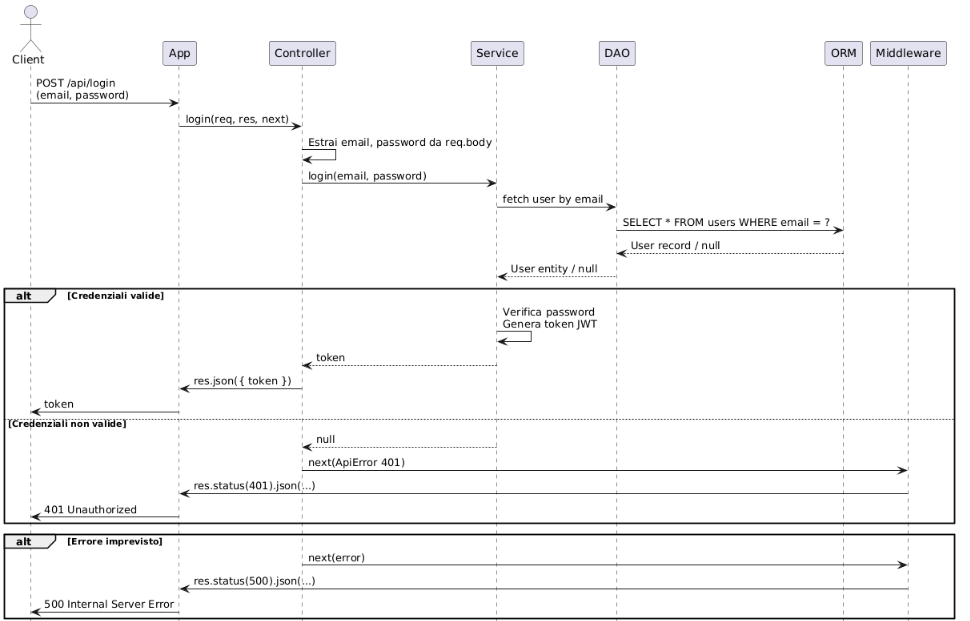 |
| GET /api/invoices | 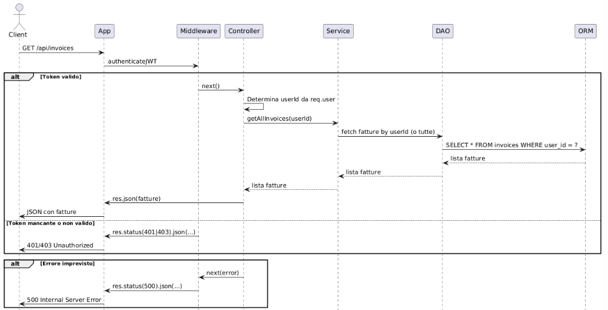 |
| GET /api/invoices/:id/pdf | 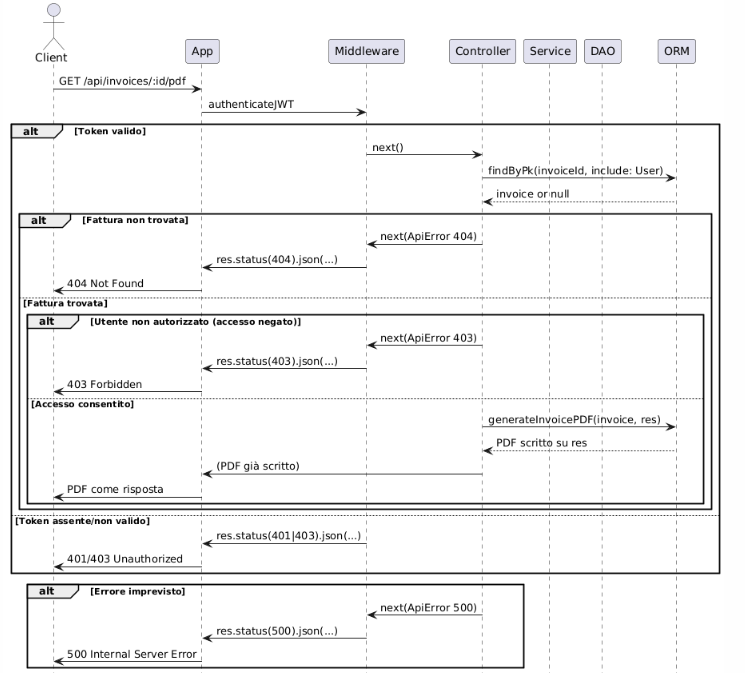 |
| POST /api/invoices/:id/pay | 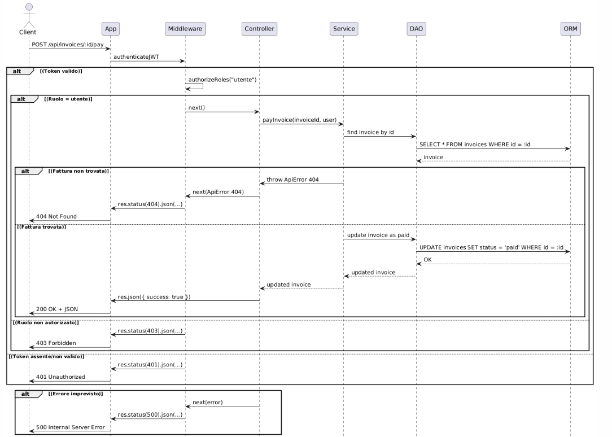 |
| GET /api/gates | 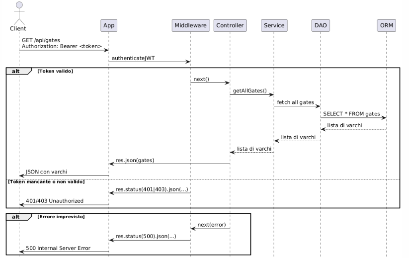 |
| PUT /api/gates/:id | 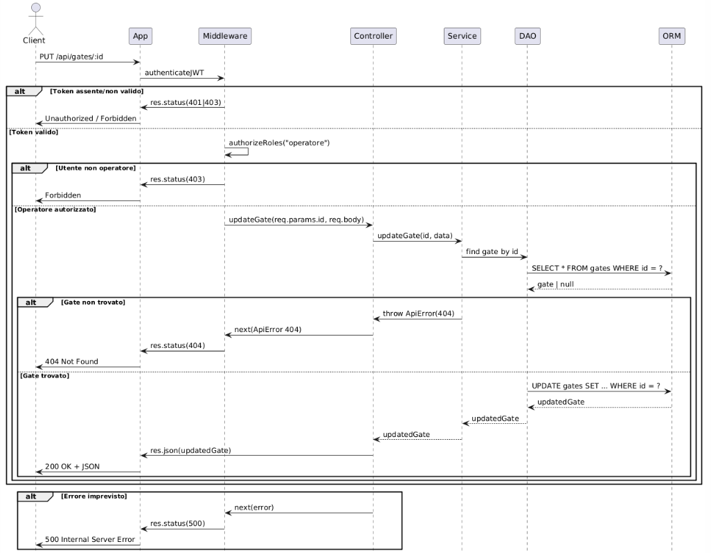 |
| POST /api/parkings | 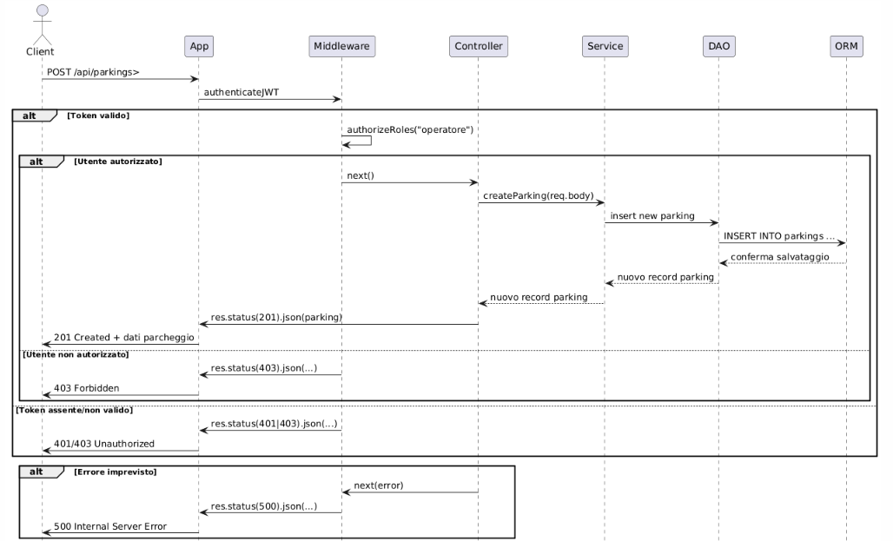 |
| GET /api/parkings/:id/available | 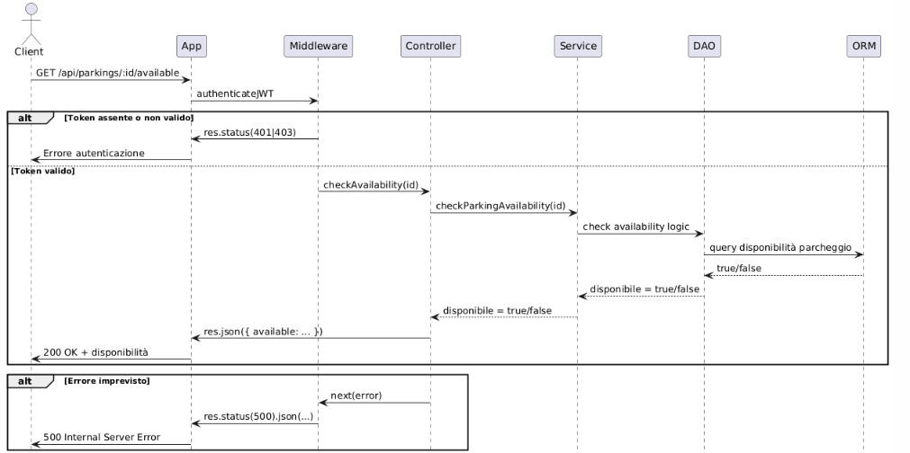 |
| POST /api/tariffs | 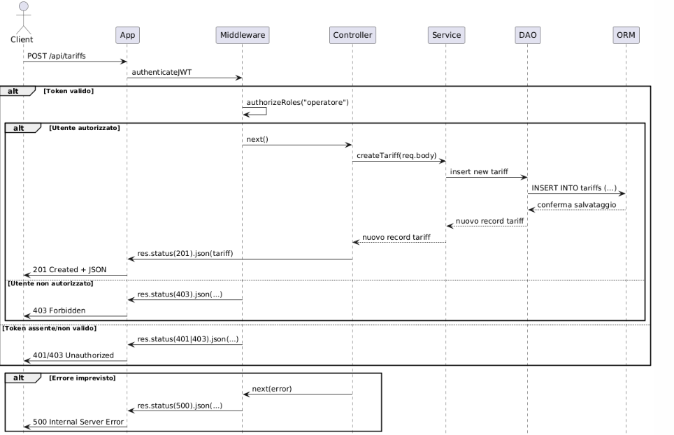 |
| POST /api/transit/search | 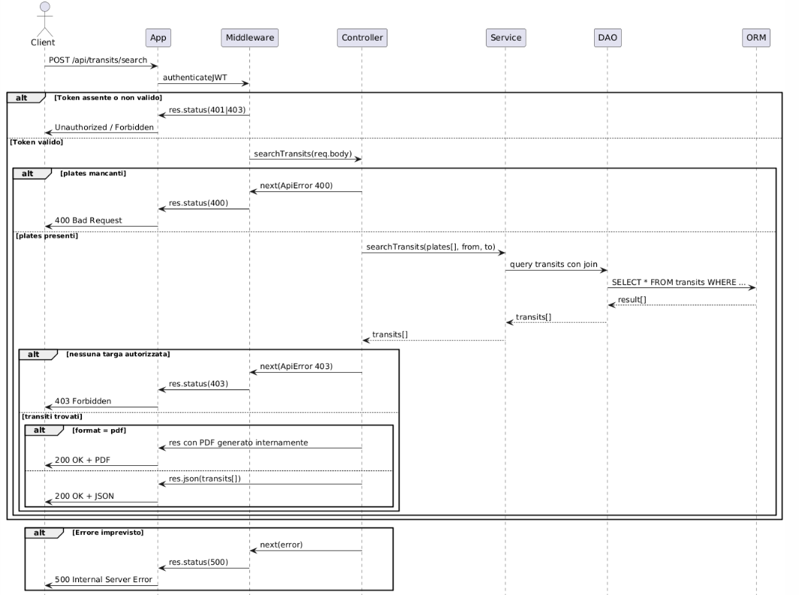 |
| POST /api/transits/auto | 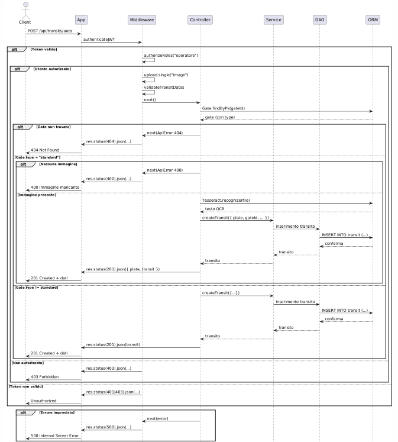 |
| GET /api/vehicle-types |  |
| PUT /api/vehicle-types/:id | 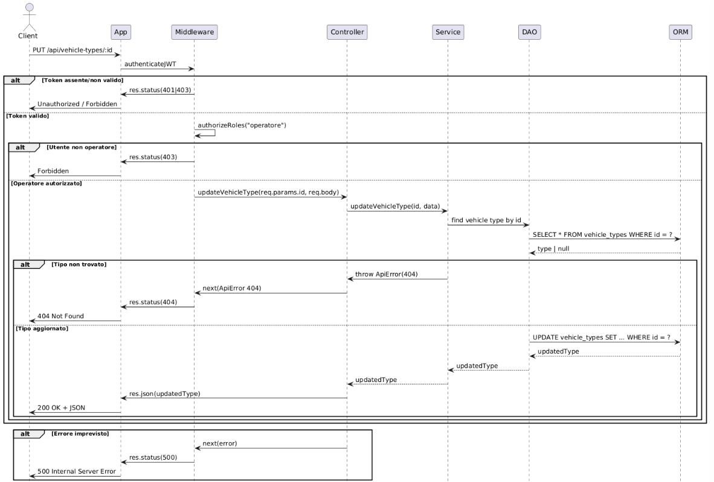 |
| POST /api/users | 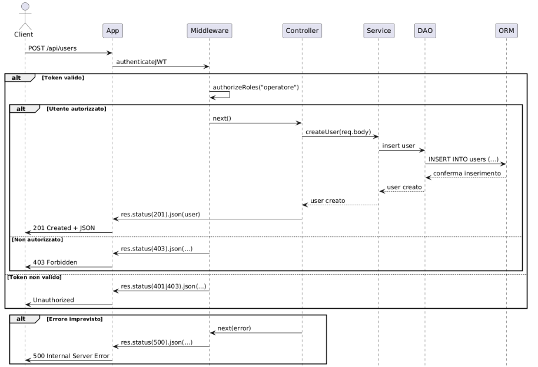 |
| PUT /api/users/:id | 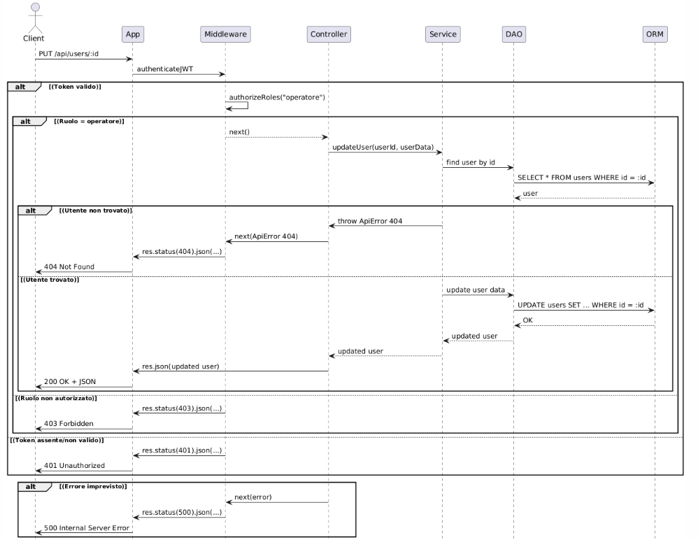 |
| POST /api/user-vehicles | 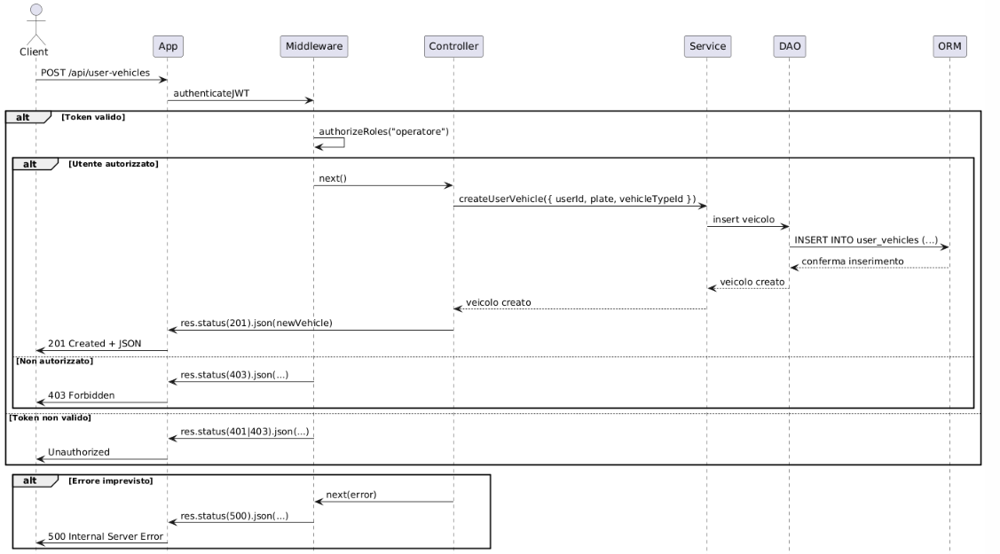 |
| GET /api/stats/fatturato | 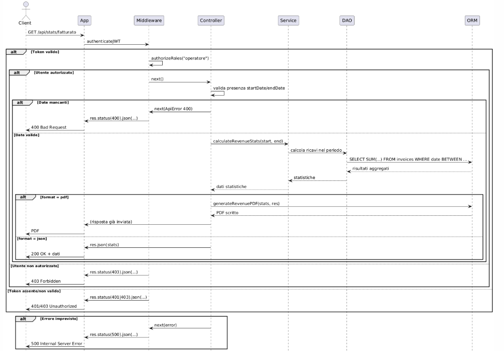 |

---
## 🚀 Come avviare il progetto

Per eseguire il progetto in locale è necessario avere installati Docker e Docker Compose.

1. Clonare il repository:

   ```bash
   git clone https://github.com/LoreG002/Backend-per-la-gestione-di-parcheggi-multi-accesso-con-OCR-fatturazione-automatica-e-statistiche.git
   cd Backend-per-la-gestione-di-parcheggi-multi-accesso-con-OCR-fatturazione-automatica-e-statistiche

2. Creare un file .env nella root del progetto con le seguenti variabili di ambiente:
  
   ```bash
   PORT=3000
   JWT_SECRET=supersegreto
   DB_HOST=db
   DB_USER=postgres
   DB_PASSWORD=postgres
   DB_NAME=parcheggi
   ```
3. Avviare l’ambiente con Docker:

  ```bash
  docker-compose up --build
  ```


## 👥 Autori

- Lorenzo Giannetti
- Niccolò Balloni
- Francesco Concetti


